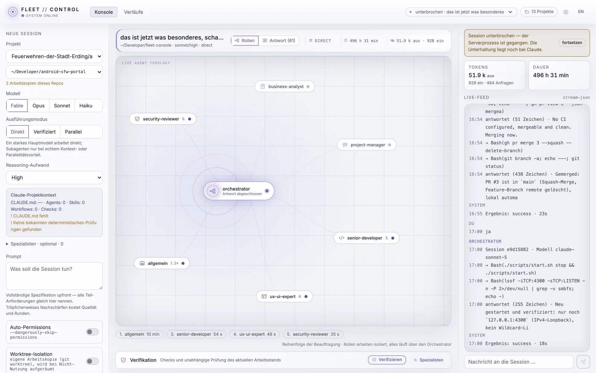
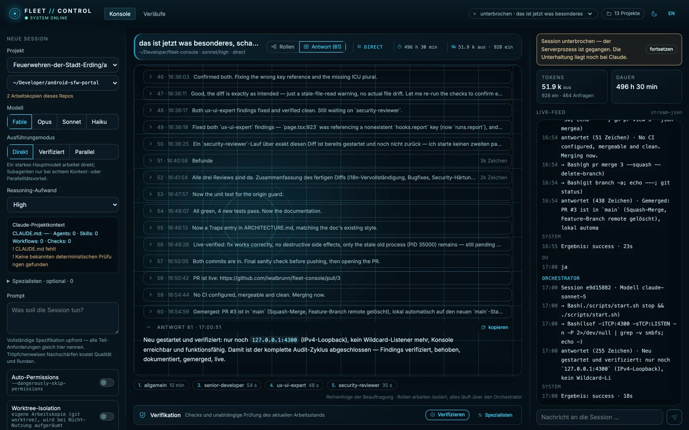
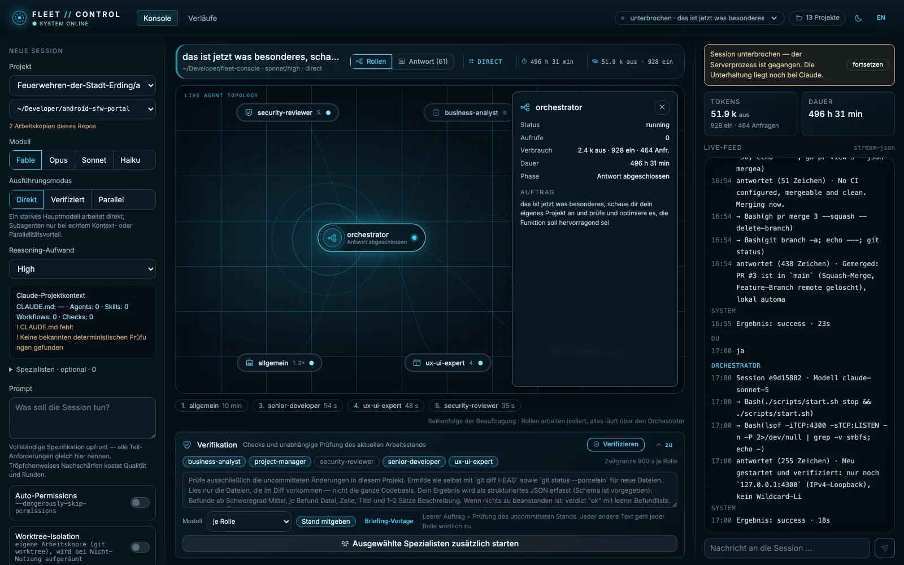

# Fleet Console


**A local command center for Claude Code.** Fleet Console starts and observes
Claude Code sessions, keeps requirements outside the model context, selects the
lightest useful execution mode and can independently verify completed changes.

The application is deliberately a control plane, not another agent framework.
Claude Code remains the runtime; Fleet adds durable state, process control,
multi-project visibility and evidence-based verification around it.

> The interface is available in German and English. Documentation and code use
> English for public concepts and German where it keeps the personal workflow
> easier to understand.

## Why Fleet Console v2

Strong coding models no longer benefit from a fixed council of personas on
every task. Multiple full sessions often add coordination cost, duplicate the
same repository reads and produce overlapping review findings.

Fleet therefore follows a simpler policy:

1. Let one strong implementation session work directly.
2. Use subagents only for bounded context isolation or genuinely independent
   work.
3. Run deterministic checks before asking another model to review code.
4. Use one fresh verifier for an independent second opinion.
5. Delegate large parallel work to Claude Code's native Workflow runtime.

## Execution modes

### Direct

The default for ordinary implementation work.

- One main Claude Code session owns the change.
- Built-in Explore, Plan and project agents remain available.
- Claude delegates only when a focused side task benefits from a separate
  context.
- Fleet derives a verification recommendation from the resulting diff without
  spending another model request.

### Verified

Direct implementation followed automatically by an independent quality gate.

1. Fleet runs the available `package.json` checks in this order by default:
   `typecheck`, `test`, `lint`, `build`.
2. Changed paths are classified into a risk level and review focus.
3. A fresh, read-only `change-verifier` receives the server-owned requirements,
   deterministic check evidence, risk assessment and current working diff.
4. The verifier returns a schema-validated verdict with concrete findings.

The verifier cannot edit files. It tries to disprove completion instead of
repeating the implementer's self-review.

### Parallel

For migrations, audits and features that can be split into independent units.

- Fleet starts Claude Code with `--effort ultracode`.
- Claude decides whether the task warrants a native Dynamic Workflow.
- Sequential tasks and same-file changes stay with the main session.
- Native workflow agents remain visible through the forwarded event stream.

Parallel mode intentionally does not use experimental Agent Teams. Headless
`claude -p` sessions can run workflows, while Agent Teams still require an
interactive lead session.

## Project intelligence

Selecting a working copy makes Fleet inspect the configuration Claude will
actually use:

- `CLAUDE.md`
- `.claude/settings.json`
- `.claude/settings.local.json`
- `.claude/agents/**`
- `.claude/skills/**`
- `.claude/workflows/**`
- known deterministic `package.json` scripts

Project agents override personal agents with the same name, matching Claude
Code's own precedence. Agent directories are scanned recursively and common
frontmatter lists are understood.

The sidebar warns when a project has no `CLAUDE.md` or no recognized checks.

### Skill visibility

Fleet starts the normal Claude CLI in the selected working directory, so the
personal, project and plugin configuration is preserved. The project card counts
only project-local files. A separate expandable list shows the skills, commands
and agents that the CLI reports during session initialization. This is
availability, not proof of execution: actual Skill tool calls appear as
`Skill(name)` in the live feed, and Claude loads a skill's full instructions
only when it is invoked.

## Core capabilities

### Durable requirements

Every user message becomes a server-owned requirement entry. The model may
update only `status` and `notiz` for existing entries; it cannot silently add,
replace or delete requirements.

Open requirements can be handed to a fresh session. This provides a clean
context reset instead of relying on another compaction of an overloaded
conversation.

### Live command center

The console shows:

- main session and native subagents,
- active tools and phases,
- token and request counts,
- Claude subscription allowance (5-hour and weekly windows, reset times and freshness),
- current requirements,
- answers and questions requiring human attention,
- deterministic checks and verifier findings,
- past Claude Code sessions.

The v2 interface uses a compact command-center visual system: a dark blue-black
ground, translucent panels, cyan data-flow signals and a central live topology.
It is inspired by modern Jarvis-style dashboards while keeping long-running
developer work readable. A light theme rebinds every token for daylight work;
the theme follows the system preference and can be pinned from the top bar.



The answer view collects the session's replies as a numbered, collapsible
thread, so a long run can be read back without scrolling through the raw
stream:



The verification card runs the deterministic checks and the independent
verifier. Specialists stay folded away until a change actually calls for them:



### Subscription allowance and token accounting

The allowance card shows the 5-hour and weekly windows of the Claude
subscription with reset times and the time of the last observation. The
percentages come from the local CLI's `rate_limit_event` messages, including
`unifiedWindows` when available. Fleet reads no OAuth credentials and makes no
separate usage API calls. Missing or expired values stay marked as unavailable
instead of being estimated from tokens; the card links to Claude's usage page for
activity from other clients. The earlier dollar estimate is no longer presented
as subscription spending.

Session totals are reconciled with the CLI's final `modelUsage`, including
reasoning and nested subagents, so counts during a turn are provisional. Input
means fresh tokens plus cache writes; cache reads are tracked separately and
accumulated once per message. Historical runs are deduplicated by message ID.

### Resilient live stream

Temporary network failures reconnect automatically and replace the client state
from the server snapshot. Failed message submissions keep the draft and show the
server error. Archived sessions display a saved snapshot. Diagnostic stderr
output stays visible without being labeled a failure; structured errors and
nonzero process exits are reported explicitly.

### Worktree isolation

A session can run in its own Git worktree under
`~/.fleet-console/worktrees/`.

- Unchanged worktrees are removed automatically when the process ends,
  whether it finished, was stopped or crashed.
- Worktrees with changes or commits are retained and reported.
- Interrupted sessions keep their worktree for resumption.

### Session recovery

Fleet persists session metadata under `~/.claude/fleet-console/`. If the server
restarts, recorded runs become interrupted rather than disappearing. Sessions
with a Claude session ID can be resumed using `--resume`.

### Optional specialists

The expandable specialist section can still launch selected custom agents as
separate, bounded sessions. This is an explicit expert tool, not the default
quality mechanism.

Specialist runs support project or personal agent definitions, per-agent model
selection, bounded parallelism, timeouts, structured verdicts, persisted
reports and at most two re-check rounds before findings return to the human.

## Requirements

- Claude Code installed and authenticated (`claude` on `PATH`)
- Node.js 20 or newer
- npm
- macOS only for the optional double-click `.app` launcher
- a local Git repository for worktree isolation and diff verification

Fleet inherits the existing Claude Code login. It does not read credentials or
require an Anthropic API key. Runs count against the same subscription or
organization allowance as the local CLI.

## Installation

```bash
git clone https://github.com/iwalbrunn/fleet-console.git
cd fleet-console
npm install
cp .env.example .env.local
npm run dev
```

Open [http://127.0.0.1:4300](http://127.0.0.1:4300).

For a production build running locally:

```bash
npm run build
npm run start
```

### macOS launcher

```bash
scripts/install-app.sh
```

This creates `Fleet Console.app`. The launcher rebuilds when required, starts
the local server and opens the browser.

```bash
scripts/start.sh
scripts/start.sh status
scripts/start.sh stop
```

Server output is written to `~/.claude/fleet-console/server.log`.

## Configuration

Copy `.env.example` to `.env.local` and adjust what you need.

| Variable                   |                     Default | Purpose                                   |
| -------------------------- | --------------------------: | ----------------------------------------- |
| `FLEET_PROJECT_ROOTS`      |               `~/Developer` | Colon-separated project roots             |
| `FLEET_CLAUDE_BIN`         |                    `claude` | Claude Code executable                    |
| `FLEET_AUTOCOMPACT`        |                    `200000` | Context size before compaction            |
| `FLEET_VERIFY_CHECKS`      | `typecheck,test,lint,build` | Ordered scripts before verification       |
| `FLEET_VERIFY_TIMEOUT_SEC` |                       `600` | Timeout for each deterministic check      |
| `FLEET_PIPELINE_PARALLEL`  |                         `3` | Concurrent optional specialist runs       |
| `FLEET_ROLE_TIMEOUT_SEC`   |                       `900` | Timeout for each specialist               |
| `FLEET_GRACE_SEC`          |                        `10` | Grace period before SIGKILL               |
| `FLEET_DIFF_MAX`           |                     `60000` | Maximum attached working-state characters |
| `FLEET_PIPELINE_MODEL`     |                    `sonnet` | Specialist display fallback               |

## Development

```bash
npm test
npm run typecheck
npm run lint
npm run build
```

The repository includes a concise `CLAUDE.md` with architecture boundaries,
verification rules and required checks.

| Module                            | Responsibility                              |
| --------------------------------- | ------------------------------------------- |
| `src/lib/sessions.ts`             | Public application facade                   |
| `src/lib/claude-process.ts`       | Claude CLI lifecycle                        |
| `src/lib/claude-events.ts`        | Stream event parsing                        |
| `src/lib/project-intelligence.ts` | Claude project configuration discovery      |
| `src/lib/verification.ts`         | Risk routing, checks and universal verifier |
| `src/lib/review-pipeline.ts`      | Optional specialist process pipeline        |
| `src/lib/session-requirements.ts` | Server-owned requirements                   |
| `src/lib/session-storage.ts`      | Persistent run state                        |
| `src/lib/quota.ts`                | CLI-reported subscription allowance         |
| `src/lib/session-worktrees.ts`    | Git worktree isolation                      |

More implementation detail and known traps are documented in
[`docs/ARCHITECTURE.md`](docs/ARCHITECTURE.md).

## Security

Fleet Console intentionally binds to `127.0.0.1` and has no multi-user
authentication. Do not expose it to a LAN, Tailnet or the public internet.

Anyone who can reach the API can start processes in configured project
directories under the local Claude account. State-changing endpoints therefore
also reject cross-origin requests whose `Origin` and `Host` do not describe the
same loopback origin.

The Auto-Permissions option passes `--dangerously-skip-permissions`. It is off
by default and should be combined with worktree or container isolation when
used unattended.

## Scope

Fleet Console is a personal, local-first tool rather than a hosted SaaS
product. It intentionally has no public deployment, multi-user authentication,
direct model API integration, external database or replacement agent framework.

## License

MIT — see [`LICENSE`](LICENSE).
