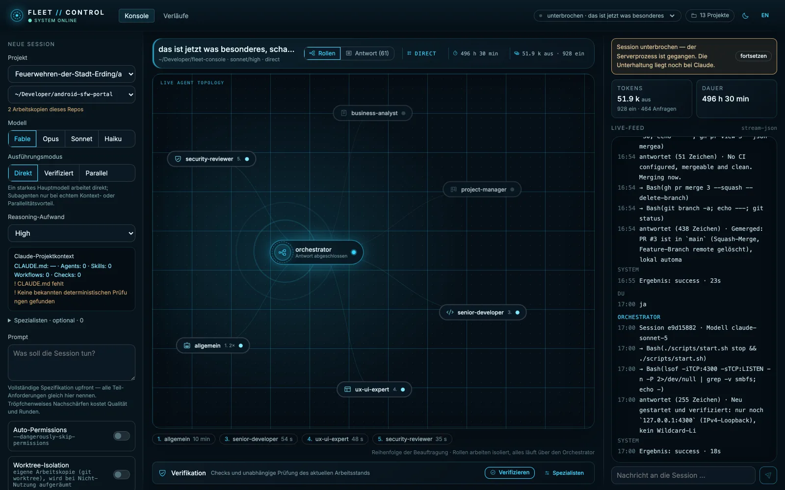
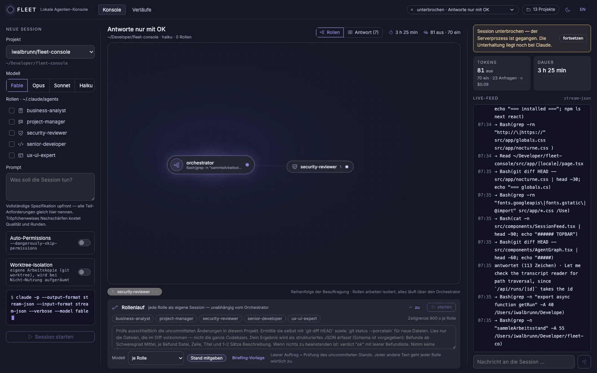
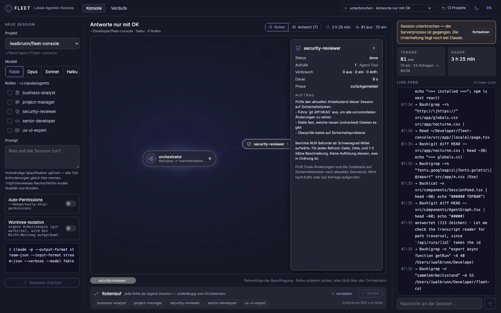
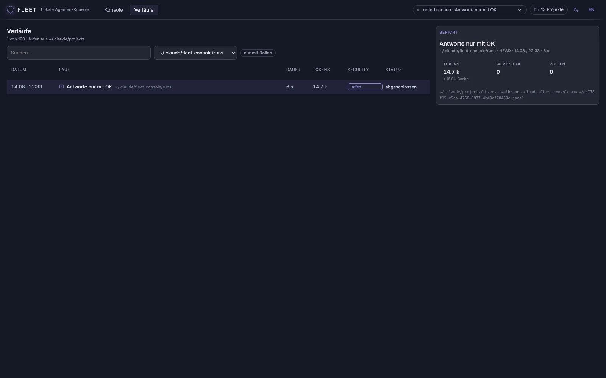

# Fleet Console


A local agent console for Claude Code: start sessions and watch them live,
browse past runs, manage hooks and scheduled night runs.



*Three roles working at the same time, each in its own session. The feed on
the right shows what happened before that: the round ended without the
orchestrator delegating to a single role — which is exactly why the role run
exists.*

Built from the design draft "Fleet Console for agent visualisation" in the
**Nocturne** design system (`src/app/nocturne.css`, described in
`DESIGNSYSTEM.md`). Colors, spacing and states come from its tokens — no
hand-picked hex values.

How it works internally is in [docs/ARCHITECTURE.md](docs/ARCHITECTURE.md),
including the traps that showed up while building it.

> **Note on language.** The documentation is English; the interface itself is
> German, and so are the code comments. This is a personal tool, published
> because the approach may be useful to others — not a product.

> **How this was built.** Large parts of this console were written with AI
> assistance — vibe coding, in the current vocabulary — by someone who is not a
> professional developer. That is worth knowing before you run it: read the
> code, keep it on localhost, and treat it as what it is. It is also the reason
> the whole thing exists. If a model writes the code, the review cannot be left
> to the same model on a good day; it has to be assigned. That is what the role
> run below does.

## Requirements

- **Claude Code** installed and logged in — `claude` has to be on your `PATH`.
  The console never asks for credentials; it inherits that login.
- **Node.js 20+** and npm.
- **macOS** for the double-click launcher (`scripts/install-app.sh` builds an
  `.app` bundle). Everything else works anywhere Next.js runs; start it with
  `scripts/start.sh` or `npm run dev`.
- Optional: roles in `~/.claude/agents` for role runs, and an SSH host for
  night runs.

## Getting started

One-time setup:

```bash
npm install
cp .env.example .env.local   # adjust
```

**Double-click launch.** Run `scripts/install-app.sh` once and you get a
`Fleet Console.app` on your desktop (or wherever you want:
`scripts/install-app.sh ~/Applications`). A double-click rebuilds the current
version if needed, starts the server in the background and opens the console
in your browser. If it is already running, only the window opens.

The app is just a shell around `scripts/start.sh`, so changes to that script
take effect immediately. If the repository moves, run `install-app.sh` again.

```bash
scripts/start.sh          # start, or open the window
scripts/start.sh status   # check
scripts/start.sh stop     # stop
```

The server keeps running in the background with no window open. Its output
goes to `~/.claude/fleet-console/server.log`.

**For development**, use fast refresh instead:

```bash
npm run dev                  # http://localhost:4300
```

## What the three views do

**Console** — pick a project, a model and the roles, type a prompt, start the
session. Behind it runs

```
claude -p --output-format stream-json --input-format stream-json --verbose --model <model>
```

as a child process in the selected project directory. The stream is parsed and
pushed to the browser over server-sent events: live feed, token counters and
the graph. Every role is a node; when the orchestrator calls it through the
Agent tool, the node goes active and its edge shows flow. The input box at the
bottom right sends further messages into a *running* session — that is what
`--input-format stream-json` is for.

When roles are selected, the session also runs with
`--forward-subagent-text`. Subagent events then arrive in the same stream,
identified by `parent_tool_use_id`. Only with that does the graph show *what*
a role is doing, and only then can its tokens be attributed to it — before,
the time between delegation and reply was a black box.

**The graph** is force-based: nodes repel each other, the edges to the
orchestrator pull like springs, working roles jitter slightly and glow. Once
everything settles and nobody is working, the simulation stops — otherwise the
chips would be a moving target and the fan would run forever. Clicking a node
opens the side panel with its task, usage and full reply.

**The answer view** puts what matters first: a highlighted box on top lists
the questions and requests extracted from the latest reply — the things the
session actually needs from you — before any prose. Older replies collapse to
one line each (timestamp plus first line) and expand on click, so a long
session does not greet you with a wall of text.

The layout is responsive: on narrow windows the two side columns turn into
drawers that slide over the content instead of squeezing it.

### Role runs

The **Rollenlauf** (role run) button below the graph starts every selected
role as its own session:

```
claude -p --output-format stream-json --verbose --agent <role> --model <m>
```

That is the difference from appending text to a message: it does not depend on
whether the orchestrator feels like using the Agent tool. That was the sore
point before — a round could end without any review at all.

- **Parallel**, three at a time by default (`FLEET_PIPELINE_PARALLEL`).
- **Custom task** possible; empty means: review the uncommitted state. This
  lets you point a run at one specific question instead of always running the
  same default review.
- **Collect the working state once.** The console runs `git status`,
  `git diff HEAD` and reads new files itself, then attaches the result to every
  role task (up to `FLEET_DIFF_MAX`, 60,000 characters by default, truncated
  beyond that). Before, every role gathered the same thing separately — with
  five roles, five times over. Measured on the same case: **1 request instead
  of 12.** You can turn it off with *Stand mitgeben*; each role then gets the
  instruction to collect it itself again.
  If there is nothing uncommitted and no custom task was typed, nothing starts
  at all — rather than sending five roles at an empty diff.
- **Model per role** (default). Without `--model`, the CLI reads `model:` from
  the role file: `security-reviewer` runs on Opus, the rest on Sonnet. The
  selector can force one model for all of them instead.
- **Time limit** per role (`FLEET_ROLE_TIMEOUT_SEC`, 900 s by default), then
  SIGTERM, and SIGKILL after `FLEET_GRACE_SEC`.
- **Its own accounting** per role: tokens, requests and duration sit on the
  node.
- The full reply is written to `reports/<run>-<role>.md`.
- **Roles that the diff does not touch are skipped.** With the default review
  task, `ux-ui-expert` only runs when the diff actually contains UI files —
  the node says so instead of silently burning a session on nothing.
- **Re-check instead of full review.** If a role already reviewed this
  session, the next default run hands it its own previous findings plus the
  new diff and asks only: which of these are fixed, and is anything new in
  the changed spots? That is far cheaper than reviewing the whole diff again.

Role runs set `SECURITY_REVIEW_GATE=off`. Otherwise the stop hook asks *every*
session to start the `security-reviewer` through the Agent tool — a tool a
role does not even have. It then burns turns explaining that it can't. The
role run *is* the review.

After a role run that included the `security-reviewer` finishes cleanly, the
console marks the current working state as reviewed
(`security-review-gate.sh mark`). The stop hook of the main session then
recognises the state and does not demand a second review of the same diff —
one review per state, no matter who triggered it.



**Important:** none of the roles in `~/.claude/agents` has `Edit` or `Write` —
deliberately. A review that writes to the same code in parallel causes more
trouble than it is worth. So a role run **judges**, it does not implement. A
custom task does not change that; it only moves *what* is being judged.

Clicking a chip opens the side panel: task, usage, duration and the full reply.



**History** — reads `~/.claude/projects/*/*.jsonl`, i.e. every past Claude Code
session on this machine: date, prompt, duration, tokens, tools used, roles
involved, files written. Results are cached by mtime.



**Hooks** — shows the hooks from `~/.claude/settings.json`, the state of the
security gate with its recent triggers, and manages the night runs on the
server.


## Project selection

The list comes from the file system, not from GitHub — a session needs a
working copy on disk. `FLEET_PROJECT_ROOTS` decides where to look: an entry
that is itself a Git repository counts as one project, anything else is
scanned one level deep.

Projects are named after their GitHub remote (`owner/name` from
`git remote get-url origin`), not after their path. That has two consequences:
two working copies of the same repository show up as **one** entry with a
second selector for the copy, instead of masquerading as two projects. Folders
without a remote are listed as "local" and sorted to the end. Nothing is
fetched from GitHub and no login is required.

## Authentication

The console calls your local `claude` CLI and inherits its login — the Claude
subscription. **No API key** is needed or read. Runs count against the same
quota as your interactive work.

## Night runs on a server

`FLEET_VPS_HOST` must be reachable over SSH with a key and no password. The
console manages **only** cron lines carrying the marker
`# fleet-console:<name>` — every other line of the crontab is read, counted and
written back unchanged. Schedule and name are validated before writing.

For night runs, `claude` must be installed and authenticated on that host
(`CLAUDE_CODE_OAUTH_TOKEN`, created with `claude setup-token`). The status at
the top of the card shows whether that is the case. `FLEET_VPS_ENABLED=false`
turns the whole area off.

## Security notes

- The server binds to localhost. Do not expose it: whoever reaches the API can
  start processes in your project directories — under your Claude account.
- The **Auto-Permissions** switch sets `--dangerously-skip-permissions`.
  Required for unattended runs, but it hands the session every right your user
  has. Off by default.
- Before writing `settings.json`, a copy is placed next to it as
  `settings.json.bak-fleet-<time>`.

## Terms of use and your account

This is a wrapper around Anthropic's own CLI, not a re-implementation of it.
Fleet Console spawns the `claude` binary and reads its event stream; it never
touches your OAuth credentials, never calls the Claude API directly and ships
no Anthropic code. Running Claude Code non-interactively is a documented
feature ([run Claude Code
programmatically](https://code.claude.com/docs/en/headless)), and subscription
authentication for automated runs is explicitly supported through
`claude setup-token` / `CLAUDE_CODE_OAUTH_TOKEN`.

Three lines you should not cross, all of them from Anthropic's
[Usage Policy](https://www.anthropic.com/legal/aup) and
[Consumer Terms](https://www.anthropic.com/legal/consumer-terms):

- **One account, one person.** Sharing your account or making it available to
  others is not allowed — which is the real reason this console has no
  multi-user mode and binds to localhost. If you put it on a server, keep it
  behind your own network boundary.
- **Do not work around limits.** No rotating accounts, no retry loops built to
  dodge rate limits. Role runs consume the same quota as interactive work; the
  parallelism setting is there to keep that visible, not to multiply it.
- **Do not resell.** Publishing the source is fine; running it as a service for
  other people on your own subscription is not.

Not affiliated with, endorsed by, or sponsored by Anthropic. "Claude" and
"Claude Code" are trademarks of Anthropic PBC and are used here only to say
what this tool drives.

## Where data lives

| Path | Contents |
|---|---|
| `~/.claude/projects/*/*.jsonl` | Source of the history view (read only) |
| `~/.claude/fleet-console/runs/` | State of runs started here, written continuously |
| `~/.claude/fleet-console/reports/` | Final text per run, plus `<run>-<role>.md` per role |
| `~/.claude/fleet-console/gate.log` | Triggers of the security stop hook |

## Limits

- Sessions live inside the server's Node process. Restart it and they appear
  as **interrupted**: the state comes back from disk, the conversation comes
  back from Claude via `--resume`. Clicking *fortsetzen* (resume) picks them up
  again. Runs without a Claude session ID — the process never got that far —
  count as aborted.
- A running role run does **not** survive a server restart; the role processes
  die with it. Reports written up to that point remain.
- A session with stream input does not end on its own — it waits for further
  messages. "Abbrechen" (cancel) ends it and all running roles.
- The graph only shows roles working when the orchestrator calls them **or** a
  role run was started. Plain single sessions show the orchestrator node only.

## License

[MIT](LICENSE) — for this console only. It does not cover Claude Code, which is
Anthropic software you install and license yourself, and it grants no rights to
Anthropic's trademarks.

